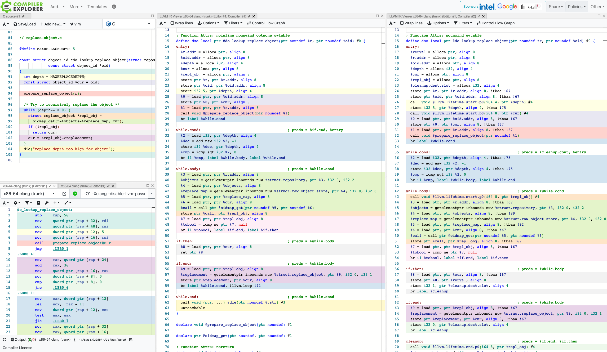

I used to naively assume that Clang always handed off "basically" the same IR to
the LLVM optimisation pipeline regardless of optimisation level. I was at least
aware of the `optnone` attribute set on functions when compiling at `-O0`, but
I've slowly started to notice there are more divergences than just that.

## Survey

In an attempt to gain a bit more understanding into exactly what kinds of
decisions depend on optimisation level in Clang, I surveyed the [IR emission
code
paths](https://github.com/search?q=repo%3Allvm%2Fllvm-project+path%3A%2F%5Eclang%5C%2Flib%5C%2FCodeGen%5C%2F%2F+OptimizationLevel&type=code).
I examined Clang source at commit `7c4c72b52038810a8997938a2b3485363cd6be3a`
(2024-08).

I ignored decisions related to specialised language specifics (Objective-C, ARC,
HLSL, OpenMP) and ABI details.

- When optimisation is disabled
    - [Add `block.addr` stack slot to help debugger](https://github.com/llvm/llvm-project/blob/997e5e870337e4a25b82be5b01e8f7675c350070/clang/lib/CodeGen/CGBlocks.cpp#L1503-L1513)
    - [Keep destructor distinct from base class destructor to help debugger](https://github.com/llvm/llvm-project/blob/1b8ab2f08998d3220e5d95003d47bb3d7cac966b/clang/lib/CodeGen/CGCXX.cpp#L38-L41)
    - [Keep switch case with just `break` as separate block to help debugger](https://github.com/llvm/llvm-project/blob/92aec5192ce752c984837a93227200b54faa8679/clang/lib/CodeGen/CGStmt.cpp#L1746-L1751)
    - [Add trap call for unreachable blocks](https://github.com/llvm/llvm-project/blob/d179acd0484bac30c5ebbbed4d29a4734d92ac93/clang/lib/CodeGen/CodeGenFunction.cpp#L1581-L1582)
    - [Add `optnone` function attribute](https://github.com/llvm/llvm-project/blob/92aec5192ce752c984837a93227200b54faa8679/clang/lib/CodeGen/CodeGenModule.cpp#L2485-L2488)
- When optimisation is enabled
    - [Check if `errno` is disabled](https://github.com/llvm/llvm-project/blob/e91e0f52895e2b23bd690a86dbaafd979e027d29/clang/lib/CodeGen/CGBuiltin.cpp#L2585-L2587)
    - [Pass `__builtin_expect` along via `llvm.expect`](https://github.com/llvm/llvm-project/blob/e91e0f52895e2b23bd690a86dbaafd979e027d29/clang/lib/CodeGen/CGBuiltin.cpp#L3366-L3370) ([2](https://github.com/llvm/llvm-project/blob/e91e0f52895e2b23bd690a86dbaafd979e027d29/clang/lib/CodeGen/CGBuiltin.cpp#L3392-L3396))
    - [Add various virtual table invariants and assumptions](https://github.com/llvm/llvm-project/blob/4497ec293a6e745be817dc88027169bd5e4f7246/clang/lib/CodeGen/CGClass.cpp#L1309-L1312) (more in same file)
    - [Split constant struct / array stores into sequence for each field](https://github.com/llvm/llvm-project/blob/2f8f58dd17a11934e8c8ec212b6474f76fb18e61/clang/lib/CodeGen/CGDecl.cpp#L1008-L1009)
    - [Add various variable invariants](https://github.com/llvm/llvm-project/blob/07f8a65d09608d67bfd6adbd62bb0999c7363456/clang/lib/CodeGen/CGDeclCXX.cpp#L158-L160)
    - [Add load range metadata](https://github.com/llvm/llvm-project/blob/92aec5192ce752c984837a93227200b54faa8679/clang/lib/CodeGen/CGExpr.cpp#L2010-L2015)
    - [Add matrix index assumptions](https://github.com/llvm/llvm-project/blob/92aec5192ce752c984837a93227200b54faa8679/clang/lib/CodeGen/CGExpr.cpp#L2240-L2244) ([2](https://github.com/llvm/llvm-project/blob/92aec5192ce752c984837a93227200b54faa8679/clang/lib/CodeGen/CGExpr.cpp#L2403-L2407), [3](https://github.com/llvm/llvm-project/blob/e108853ac8fad27ff22be9303c87d90bcdf0ef53/clang/lib/CodeGen/CGExprScalar.cpp#L2005-L2006))
    - [Collapse trap calls](https://github.com/llvm/llvm-project/blob/92aec5192ce752c984837a93227200b54faa8679/clang/lib/CodeGen/CGExpr.cpp#L3842-L3850)
    - [Add exact dynamic casts](https://github.com/llvm/llvm-project/blob/3ad31e12ccfc7db25f3cbedc4ee966e7099ac78f/clang/lib/CodeGen/CGExprCXX.cpp#L2277-L2280)
    - [Add loop unrolling metadata](https://github.com/llvm/llvm-project/blob/92fc1eb0c1ae3813f2ac9208e2c74207aae9d23f/clang/lib/CodeGen/CGLoopInfo.cpp#L822-L828)
    - [Add condition likelihood](https://github.com/llvm/llvm-project/blob/92aec5192ce752c984837a93227200b54faa8679/clang/lib/CodeGen/CGStmt.cpp#L870-L872) ([2](https://github.com/llvm/llvm-project/blob/92aec5192ce752c984837a93227200b54faa8679/clang/lib/CodeGen/CGStmt.cpp#L1049-L1051), [3](https://github.com/llvm/llvm-project/blob/92aec5192ce752c984837a93227200b54faa8679/clang/lib/CodeGen/CGStmt.cpp#L1264-L1266), [4](https://github.com/llvm/llvm-project/blob/92aec5192ce752c984837a93227200b54faa8679/clang/lib/CodeGen/CGStmt.cpp#L1367-L1369), [5](https://github.com/llvm/llvm-project/blob/d179acd0484bac30c5ebbbed4d29a4734d92ac93/clang/lib/CodeGen/CodeGenFunction.cpp#L3037-L3040))
    - [Track condition likelihood](https://github.com/llvm/llvm-project/blob/92aec5192ce752c984837a93227200b54faa8679/clang/lib/CodeGen/CGStmt.cpp#L2212-L2215)
    - [Pass `__builtin_unpredictable` along via metadata](https://github.com/llvm/llvm-project/blob/92aec5192ce752c984837a93227200b54faa8679/clang/lib/CodeGen/CGStmt.cpp#L2264-L2271) ([2](https://github.com/llvm/llvm-project/blob/d179acd0484bac30c5ebbbed4d29a4734d92ac93/clang/lib/CodeGen/CodeGenFunction.cpp#L2039-L2045))
    - [Add lifetime markers](https://github.com/llvm/llvm-project/blob/d179acd0484bac30c5ebbbed4d29a4734d92ac93/clang/lib/CodeGen/CodeGenFunction.cpp#L73-L74)
    - [Add type-based alias analysis (TBAA) metadata](https://github.com/llvm/llvm-project/blob/92aec5192ce752c984837a93227200b54faa8679/clang/lib/CodeGen/CodeGenModule.cpp#L402-L406) ([2](https://github.com/llvm/llvm-project/blob/123c036bd361de9ed6baa0090e5942105764e8db/clang/lib/CodeGen/CodeGenTBAA.cpp#L277-L279), [3](https://github.com/llvm/llvm-project/blob/123c036bd361de9ed6baa0090e5942105764e8db/clang/lib/CodeGen/CodeGenTBAA.cpp#L407-L408))
    - [Add strict virtual table metadata](https://github.com/llvm/llvm-project/blob/92aec5192ce752c984837a93227200b54faa8679/clang/lib/CodeGen/CodeGenModule.cpp#L1031-L1046)
    - [Preserve function declarations](https://github.com/llvm/llvm-project/blob/92aec5192ce752c984837a93227200b54faa8679/clang/lib/CodeGen/CodeGenModule.cpp#L4048-L4049)
    - [Add opportunistic virtual tables](https://github.com/llvm/llvm-project/blob/92aec5192ce752c984837a93227200b54faa8679/clang/lib/CodeGen/CodeGenModule.cpp#L4101-L4103)

## Example

If you'd like to explore the differences yourself, take a look at this [Compiler
Explorer example](https://godbolt.org/z/GrbohjcWa). The input source is not too
interesting (I've grabbed a random slice of Git source files that I happened to
have on hand). The left IR view shows `-O0` and the right IR view shows `-O1`
with LLVM passes disabled. We can ask Clang to produce LLVM IR without sending
it through the LLVM optimisation pipeline by adding `-Xclang
-disable-llvm-passes` (a useful tip for LLVM archaeology).

After diffing the two outputs, there are two features that are only activated
when optimisation is enabled that appear to be responsible for most of the
differences in this example:

- Lifetime markers
- Type-based alias analysis (TBAA) metadata

Lifetime markers are especially interesting in this example, as Clang actually
reshapes control flow (adding several additional `cleanup` blocks) so that it
can insert these markers (which are calls to LLVM intrinsic functions
`llvm.lifetime.start/end`).
