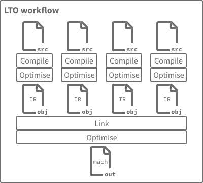
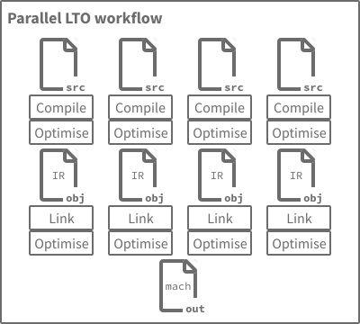

I recently started exploring link-time optimisation (LTO),
which I used to think was just a single boolean choice
in the compilation and linking workflow,
and perhaps it was like that a while ago...
I've learned that these days,
there are many different dimensions of LTO across
compilers and linkers today and more variations
[are](https://discourse.llvm.org/t/rfc-a-unified-lto-bitcode-frontend/61774)
[being](https://discourse.llvm.org/t/rfc-ffat-lto-objects-support/63977)
[proposed](https://discourse.llvm.org/t/rfc-integrated-distributed-thinlto/69641)
all the time.

In this "living guide",
I aim to cover the LTO-related features I have encountered thus far.
I intend to keep updating this going forward
as I learn about new details in this space.
I am sure there are even more corners to cover,
so if you see something that should be added, corrected, etc.
please [contact me][contact].

I am _not_ aiming to provide specific recommendations here,
as there are many tradeoffs to consider
and different applications of LTO will weigh each of those differently.
Instead, I hope this is a broadly useful portrayal of the facts.

This guide focuses on common toolchains for languages like C, Rust, etc. which
typically use ahead-of-time (AOT) compilation and linking. Alternative
toolchains for these languages and common toolchains for other languages may use
other strategies like interpreting, JIT compilation, etc. Those other language
implementation strategies do not offer LTO-like features (that I know of), so
I have ignored them here.

I hope this guide is useful to experienced compiler users and compiler hackers
who may not have heard about the latest work yet. I also hope it's broadly
accessible to those who may be unfamiliar with LTO.

---

## Basics

Normal (non-LTO) compilation compiles and optimises one file at a time.
LTO can optimise across all files at once.
The overall aim of LTO is better runtime performance through whole-program
analysis and cross-module optimisation.

Let's take a high-level look at the workflow of most AOT compile and link
toolchains. We'll start off with the "default" workflow without LTO.

In the default workflow without LTO, each unit of source code is compiled and
optimised separately to produce an object file with machine code for the target
architecture. Optimisations can only consider a single source unit at a time, so
all externally accessible symbols (functions and variables) must be preserved,
even if they will end up being unused in the final linked output. The linker
then combines these object files to produce the final output (executable or
library).

Now let's look at a workflow with LTO.

In the LTO setup, we still initially compile each source unit separately and
perform some amount of optimisation, but the output is different: instead of
machine code, the output of LTO compilation is an object file containing
the compiler's specific internal representation (IR) for that source unit.

The linking stage now performs a much more complex dance than it did before.
The IR produced from compiling each source unit is read and the compiler's
optimisation pipeline is invoked to analyse and transform the whole program (the
precise details of this varies with different LTO features, as we'll see later
in this guide). This whole program stage unlocks further optimisation
opportunities, as we can remove symbols that are unused outside the whole
program, inline functions from other source units, etc.

With those fundamentals out of the way, let's look at various features and
variants that toolchains offer to further tweak and customise this process.

## Features and variants


Some of the features found in the LTO space have "marketing" names which do not
communicate what they actually do on a technical level.
For some descriptions below, I have used my own terminology to avoid these
issues.
Each section also lists other names things are known by, in case you want to
search for more information.


### Basic LTO

This is the simplest of the LTO modes and matches the workflow described above
in [Basics](#basics).
Each compilation task produces object files containing the compiler's internal
IR format.
The linking stage combines all compilation units into a single, large module.
Interprocedural analysis and optimisation is performed on a single thread.
With large code bases, this process is likely to consume lots of memory and take
a considerable amount of time.

In terms of compile-time performance,
the LLVM project [has shown][tl] that compilation and linking of
the Clang 3.9 codebase with basic LTO is ~5x the non-LTO time.
This extra work achieves an average run-time performance improvement of 2.86%.

This mode is also referred to as "full LTO".

| Toolchain | First available | Option                      |
| --------- | --------------- | ------                      |
| Clang     | 2.6 (2009)      | `-flto` or `-flto=full`     |
| GCC       | 4.5 (2010)      | `-flto -flto-partition=one` |
| Rust      | 1.0 (2015)      | `-C lto`                    |

### Parallel LTO

Toolchains have come up with a variety of related techniques to speed up the
the link-time work of LTO while preserving (most of) the run-time performance
gains. Instead of creating a single, massive module at link time, a much smaller
global index of functions likely to be inlined is computed. With that in hand,
each compilation unit can be processed in parallel at link time while still
benefiting from most of the same whole-program optimisations as [basic
LTO](#basic-lto).

Continuing with the same [example data][tl] based on building Clang 3.9,
LLVM's implementation of parallel LTO
achieves nearly all of the run-time performance improvement
as seen with basic LTO:
basic LTO reached a 2.86% improvement over non-LTO,
while parallel LTO achieved a 2.63% improvement over non-LTO.

The compilation time improves dramatically: instead of 5x non-LTO, it's now only
1.2x non-LTO, which is quite impressive.

The technical details of how each toolchain
implements parallel LTO vary somewhat.
LLVM-based toolchains (which includes Clang and Rust from our discussions here)
optimise different compilation units in parallel
and inlines across module boundaries,
but most other cross-modules optimisations are skipped.
GCC, on the other hand,
partitions (nearly) the same optimisation work
it would have done with one thread into a batch per thread.

This suggests that GCC's parallel LTO should be able to get closer than LLVM
in achieving the same run-time performance as with basic LTO
(our recurring dataset shows a 0.23% run-time delta between
LLVM's basic and parallel modes).
At the same time, LLVM's approach may be better able to handle
incremental changes in a single module of large program.
If you would like to see data comparing the two modes in GCC,
please let me know.

This mode is also referred to as "thin LTO",
particularly in the LLVM ecosystem.
The "thin" concept on the LLVM side
refers to the fact that no IR is involved in the whole program analysis step.

| Toolchain | First available | Option                            |
| --------- | --------------- | ------                            |
| Clang     | 3.9 (2016)      | `-flto=thin`                      |
| GCC       | 4.6 (2011)      | `-flto=auto` or `-flto=<threads>` |
| Rust      | 1.25 (2018)     | `-C lto=thin`                     |

### LTO with mode selection deferred to link time

In some applications, it may be useful to support both the [basic](#basic-lto)
and [parallel](#parallel-lto) LTO modes. In this arrangement, the compiler IR
attached to each object file stores all the info it needs to run either LTO mode
at link time.

When it's time to link, you can then choose either of
the basic or parallel LTO modes via link-time compiler options
(for the toolchains mentioned here,
the program commonly referred to as just the "compiler"
is really the "compiler driver"
which in turn calls the other programs in the workflow,
such as the linker).

This variant is also referred to as "unified LTO".

| Toolchain | First available | Option               |
| --------- | --------------- | ------               |
| Clang     | 17 (2023)       | `-funified-lto`      |
| GCC       | 4.5 (2010)      | supported by default |
| Rust      | —               | —                    |

### LTO enablement decision deferred to link time

It may also be useful to push the choice of whether to use LTO at all down to
the linking step of the workflow. To support this use case, the compiler
combines _both_ machine code _and_ internal IR in the object files produced by
each compilation unit.

This variant is also referred to as "fat LTO objects".

| Toolchain | First available | Option              |
| --------- | --------------- | ------              |
| Clang     | 17 (2023)       | `-ffat-lto-objects` |
| GCC       | 4.9 (2014)      | `-ffat-lto-objects` |
| Rust      | —               | —                   |

### Other details

There are a few other more advanced corners of LTO, including:

- Distributed build support
- Symbol visibility
- Linker caching

If you're curious about any of these or other aspects, please
[let me know][contact]!
I plan to extend this guide to document additional bits of LTO
that others are interested in.

---

#### Acknowledgements

Thanks to
[Teresa Johnson][johnson],
[Jan Hubička][hubicka],
[Iti Shree][shree], and
[Laurence Tratt][tratt]
for feedback on earlier drafts.

[contact]: /contact
[tl]: https://blog.llvm.org/2016/06/thinlto-scalable-and-incremental-lto.html

[johnson]: https://discourse.llvm.org/u/teresajohnson
[hubicka]: https://www.ucw.cz/~hubicka/
[shree]: https://github.com/nmdis1999
[tratt]: https://tratt.net/laurie/
