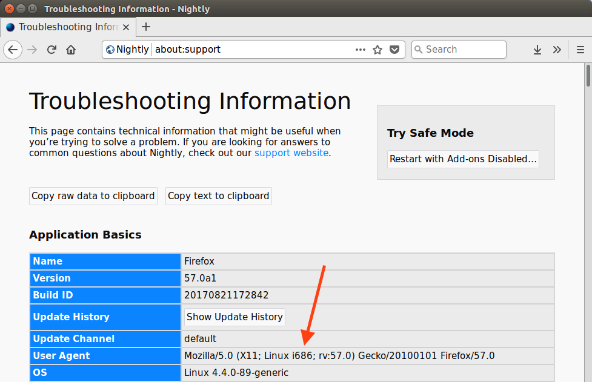

## Background

As part of my work on the Stylo / Quantum CSS team at Mozilla, I needed to be
able to test changes to Firefox that only affect Linux 32-bit builds. These
days, I believe you essentially have to use a 64-bit host to build Firefox to
avoid OOM issues during linking and potentially other steps, so this means
some form of cross-compiling from a Linux 64-bit host to a Linux 32-bit
target.

I already had a Linux 64-bit machine running Ubuntu 16.04 LTS, so I set about
attempting to make it build Firefox targeting Linux 32-bit.

I should note that I only use Linux occasionally at the moment, so there could
certainly be a better solution than the one I describe.  Also, I recreated these
steps after the fact, so I might have missed something.  Please let me know in
the comments.

This article assumes you are already set up to build Firefox when targeting
64-bit.

## Multiarch Packages (Or: How It's Supposed to Work)

Recent versions of Debian and Ubuntu support the concept of
["multiarch packages"][ma] which are intended to allow installing multiple
architectures together to support use cases including... cross-compiling!
Great, sounds like just the thing we need.

We should be able to install<sup id="a1">[1](#f1)</sup> the
[core Gecko development dependencies][cgd] with an extra `:i386` suffix to get
the 32-bit version on our 64-bit host:

```text
(host) $ sudo apt install libasound2-dev:i386 libcurl4-openssl-dev:i386 libdbus-1-dev:i386 libdbus-glib-1-dev:i386 libgconf2-dev:i386 libgtk-3-dev:i386 libgtk2.0-dev:i386 libiw-dev:i386 libnotify-dev:i386 libpulse-dev:i386 libx11-xcb-dev:i386 libxt-dev:i386 mesa-common-dev:i386
Reading package lists... Done
Building dependency tree
Reading state information... Done
Some packages could not be installed. This may mean that you have
requested an impossible situation or if you are using the unstable
distribution that some required packages have not yet been created
or been moved out of Incoming.
The following information may help to resolve the situation:

The following packages have unmet dependencies:
 libgtk-3-dev:i386 : Depends: gir1.2-gtk-3.0:i386 (= 3.18.9-1ubuntu3.3) but it is not going to be installed
                     Depends: libatk1.0-dev:i386 (>= 2.15.1) but it is not going to be installed
                     Depends: libatk-bridge2.0-dev:i386 but it is not going to be installed
                     Depends: libegl1-mesa-dev:i386 but it is not going to be installed
                     Depends: libxkbcommon-dev:i386 but it is not going to be installed
                     Depends: libmirclient-dev:i386 (>= 0.13.3) but it is not going to be installed
 libgtk2.0-dev:i386 : Depends: gir1.2-gtk-2.0:i386 (= 2.24.30-1ubuntu1.16.04.2) but it is not going to be installed
                      Depends: libatk1.0-dev:i386 (>= 1.29.2) but it is not going to be installed
                      Recommends: python:i386 (>= 2.4) but it is not going to be installed
 libnotify-dev:i386 : Depends: gir1.2-notify-0.7:i386 (= 0.7.6-2svn1) but it is not going to be installed
E: Unable to correct problems, you have held broken packages.
```

Well, that doesn't look good.  It appears some of the Gecko libraries we need
aren't happy about being installed for multiple architectures.

## Switch Approaches to `chroot`

Since multiarch packages don't appear to be working here, I looked around for
other approaches.  Ideally, I would have something fairly self-contained so that
it would be easy to remove when I no longer need 32-bit support.

One approach to multiple architectures that has been around for a while is to
create a [chroot][chroot] environment: effectively, a separate installation of
Linux for a different architecture.  A utility like `schroot` can then be used
to issue the `chroot(2)` system call which makes the current session believe
this sub-installation is the root filesystem.

Let's grab `schroot` so we'll be able to enter the chroot once it's set up:

```text
(host) $ sudo apt install schroot
```

There are several different [types of chroots][ct] you can use with `schroot`.
We'll use the `directory` type, as it's the simplest to understand (just another
directory on the existing filesystem), and it will make it simpler to expose a
few things to the host later on.

You can place the directory wherever, but some existing filesystems are mapped
into the chroot for convenience, so avoiding `/home` is probably a good idea.  I
went with `/var/chroot/linux32`:

```text
(host) $ sudo mkdir -p /var/chroot/linux32
```

We need to update `schroot.conf` to configure the new chroot:

```text
(host) $ sudo cat << EOF >> /etc/schroot/schroot.conf
[linux32]
description=Linux32 build environment
aliases=default
type=directory
directory=/var/chroot/linux32
personality=linux32
profile=desktop
users=jryans
root-users=jryans
EOF
```

In particular, `personality` is important to set for this multi-arch use case.
(Make sure to replace the user names with your own!)

Firefox will want access to shared memory as well, so we'll need to add that to
the set of mapped filesystems in the chroot:

```text
(host) $ sudo cat << EOF >> /etc/schroot/desktop/fstab
/dev/shm       /dev/shm        none    rw,bind         0       0
EOF
```

Now we need to [install the 32-bit system][db] inside the chroot.  We can do
that with a utility called `debootstrap`:

```text
(host) $ sudo apt install debootstrap
(host) $ sudo debootstrap --variant=buildd --arch=i386 --foreign xenial /var/chroot/linux32 http://archive.ubuntu.com/ubuntu
```

This will fetch all the packages for a 32-bit installation and place them in the
chroot.  For a cross-arch bootstrap, we need to add `--foreign` to skip the
unpacking step, which we will do momentarily from inside the chroot.
`--variant=buildd` will help us out a bit by including common build tools.

To finish installation, we have to enter the chroot.  You can enter the chroot
with `schroot` and it remains active until you `exit`.  Any snippets that say
`(chroot)` instead of `(host)` are meant to be run inside the chroot.

So, inside the chroot, run the second stage of `debootstrap` to actually unpack
everything:

```text
(chroot) $ /debootstrap/debootstrap --second-stage
```

Let's double-check that things are working like we expect:

```text
(chroot) $ arch
i686
```

Great, we're getting closer!

## Install packages

Now that we have a basic 32-bit installation, let's install the packages we need
for development.  The `apt` source list inside the chroot is pretty bare bones,
so we'll want to expand it a bit to reach everything we need:

```text
(chroot) $ sudo cat << EOF > /etc/apt/sources.list
deb http://archive.ubuntu.com/ubuntu xenial main universe
deb http://archive.ubuntu.com/ubuntu xenial-updates main universe
EOF
(chroot) $ sudo apt update
```

Let's grab the same packages from before (without `:i386` since that's the
default inside the chroot):

```text
(chroot) $ sudo apt install libasound2-dev libcurl4-openssl-dev libdbus-1-dev libdbus-glib-1-dev libgconf2-dev libgtk-3-dev libgtk2.0-dev libiw-dev libnotify-dev libpulse-dev libx11-xcb-dev libxt-dev mesa-common-dev python-dbus xvfb yasm
```

You may need to install the 32-bit version of your graphics card's GL library to
get reasonable graphics output when running in the 32-bit environment.

```text
(chroot) $ sudo apt install nvidia-384
```

We'll also want to have access to the X display inside the chroot.  The simple
way to achieve this is to disable X security in the host and expose the same
display in the chroot:

```text
(host) $ xhost +
(chroot) $ export DISPLAY=:0
```

We can verify that we have accelerated graphics:

```text
(chroot) $ sudo apt install mesa-utils
(chroot) $ glxinfo | grep renderer
OpenGL renderer string: GeForce GTX 1080/PCIe/SSE2
```

## Building Firefox

In order for the host to build Firefox for the 32-bit target, it needs to access
various 32-bit libraries and include files.  We already have these installed in
the chroot, so let's cheat and expose them to the host via symlinks into the
chroot's file structure:

```text
(host) $ sudo ln -s /var/chroot/linux32/lib/i386-linux-gnu /lib/
(host) $ sudo ln -s /var/chroot/linux32/usr/lib/i386-linux-gnu /usr/lib/
(host) $ sudo ln -s /var/chroot/linux32/usr/include/i386-linux-gnu /usr/include/
```

We also need Rust to be able to target 32-bit from the host, so let's install
support for that:

```text
(host) $ rustup target add i686-unknown-linux-gnu
```

We'll need a specialized `.mozconfig` for Firefox to target 32-bit.  Something
like the following:

```text
(host) $ cat << EOF > ~/projects/gecko/.mozconfig
export PKG_CONFIG_PATH="/var/chroot/linux32/usr/lib/i386-linux-gnu/pkgconfig:/var/chroot/linux32/usr/share/pkgconfig"
export MOZ_LINUX_32_SSE2_STARTUP_ERROR=1
CFLAGS="$CFLAGS -msse -msse2 -mfpmath=sse"
CXXFLAGS="$CXXFLAGS -msse -msse2 -mfpmath=sse"
if test `uname -m` = "x86_64"; then
  CFLAGS="$CFLAGS -m32 -march=pentium-m"
  CXXFLAGS="$CXXFLAGS -m32 -march=pentium-m"
  ac_add_options --target=i686-pc-linux
  ac_add_options --host=i686-pc-linux
  ac_add_options --x-libraries=/usr/lib
fi
EOF
```

This was [adapted][ml32] from the `mozconfig.linux32` used for official 32-bit
builds.  I modified the `PKG_CONFIG_PATH` to point at more 32-bit files
installed inside the chroot, similar to the library and include changes above.

Now, we should be able to build successfully:

```text
(host) $ ./mach build
```

Then, from the chroot, you can run Firefox and other tests:

```text
(chroot) $ ./mach run
```



## Footnotes

<b id="f1">1.</b> It's commonly suggested that people should use `./mach
bootstrap` to install the Firefox build dependencies, so feel free to try that
if you wish.  I dislike scripts that install system packages, so I've done it
manually here.  The bootstrap script would likely need various adjustments to
support this use case. [↩](#a1)

[ma]: https://wiki.debian.org/Multiarch
[cgd]: http://searchfox.org/mozilla-central/rev/48ea452803907f2575d81021e8678634e8067fc2/python/mozboot/mozboot/debian.py#50-61
[chroot]: https://en.wikipedia.org/wiki/Chroot
[ct]: http://manpages.ubuntu.com/manpages/xenial/man5/schroot.conf.5.html
[db]: https://help.ubuntu.com/community/DebootstrapChroot
[ml32]: http://searchfox.org/mozilla-central/rev/89e125b817c5d493babbc58ea526be970bd3748e/build/unix/mozconfig.linux32
