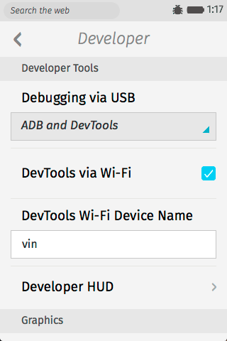
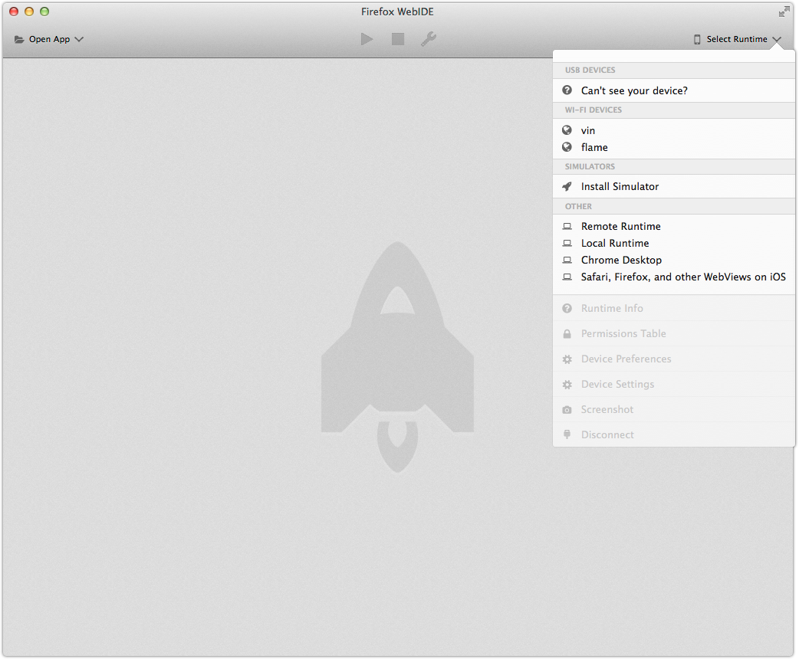
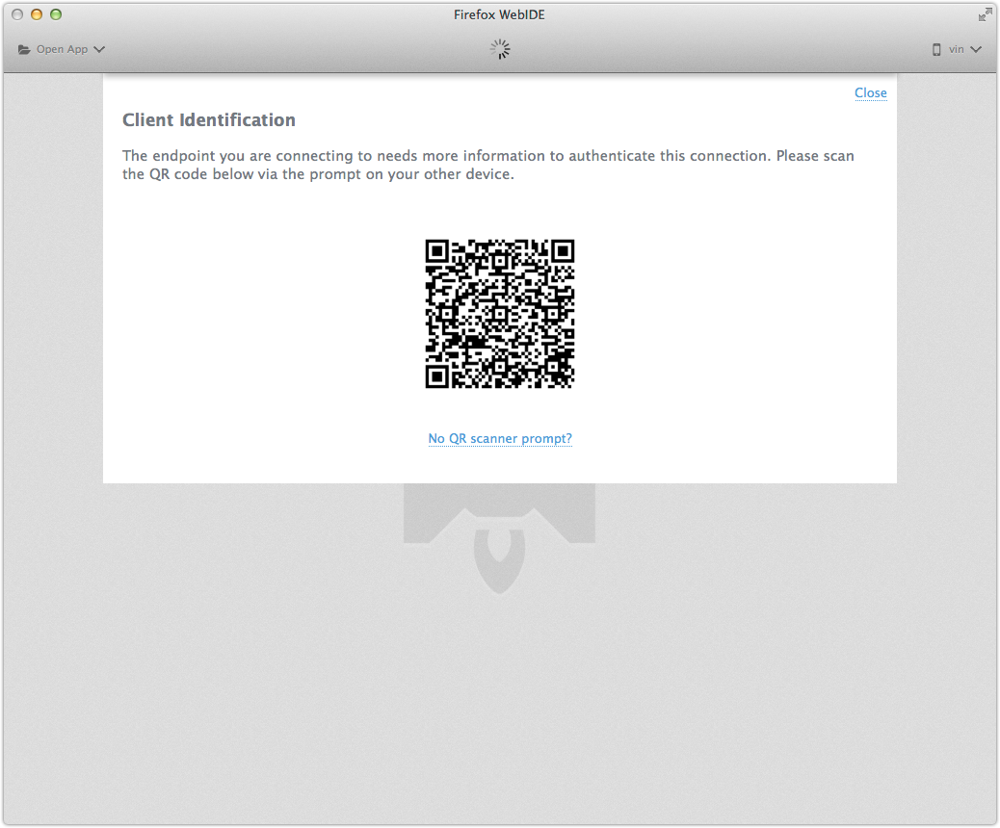

I am excited to announce that we're now shipping WiFi debugging for Firefox OS!
It's available in [Firefox OS 3.0 / master][fxos-build] with [Firefox Nightly][desktop-nightly] on desktop.

WiFi debugging allows [WebIDE][webide] to connect to your Firefox OS device via your local
WiFi network instead of a USB cable.

The connection experience is generally more straightforward (especially after
connecting to a device the first time) than with USB and also more convenient to
use since you're no longer tied down by a cable.

## Security

A large portion of this project has gone towards making the debugging
connection secure, so that you can use it safely on shared network, such as an
office or coffee shop.

We use TLS for encryption and authentication.  The computer and device both
create self-signed certificates.  When you connect, a QR code is scanned to
verify that the certificates can be trusted.  During the connection process, you
can choose to remember this information and connect immediately in the future if
desired.

## How to Use

You'll need to assemble the following bits and bobs:

* [Firefox 39][desktop-nightly] (2015-03-27 or later)
* Firefox OS 3.0 (2015-03-27 or later)
  * Option A: [Update your Flame][flame-updates] to 3.0 / master
  * Option B: [Build for your device][fxos-build] from source

On Firefox OS, enable WiFi debugging:

1. Go to Developer Settings on device (Settings -> Developer)
2. Enable DevTools via Wi-Fi
3. Edit the device name if desired

To connect from Firefox Desktop:

1. Open WebIDE in Firefox Nightly (Tools -> Web Developer -> WebIDE)
2. Click "Select Runtime" to open the runtimes panel
3. Your Firefox OS device should show up in the "WiFi Devices" section
4. A connection prompt will appear on device, choose "Scan" or "Scan and Remember"
5. Scan the QR code displayed in WebIDE

After scanning the QR code, the QR display should disappear and the "device"
icon in WebIDE will turn blue for "connected".

You can then access all of your remote apps and browser tabs just as you can
today over USB.

## Technical Aside

This process does not use ADB at all on the device, so if you find ADB
inconvenient while debugging or would rather not install ADB at all, then
WiFi debugging is the way to go.  

By skipping ADB, we don't have to worry about driver confusion, especially on
Windows and Linux.

## Supported Devices

This feature should be supported on any Firefox OS device.  So far, I've tested
it on the Flame and Nexus 4.

## Known Issues

The QR code scanner can be a bit frustrating at the moment, as real devices
appear to capture a very low resolution picture.  [Bug 1145772][low-res] aims
to improve this soon.  You should be able to scan with the Flame by trying a few
different orientations.  I would suggest using "Scan and Remember", so that
scanning is only needed for the first connection.

If you find other issues while testing, please [file bugs][bugs] or contact me
on IRC.

## Acknowledgments

This was quite a complex project, and many people provided advice and reviews
while working on this feature, including (in semi-random order):

* Brian Warner
* Trevor Perrin
* David Keeler
* Honza Bambas
* Patrick McManus
* Jason Duell
* Panos Astithas
* Jan Keromnes
* Alexandre Poirot
* Paul Rouget
* Paul Theriault

I am probably forgetting others as well, so I apologize if you were omitted.  

## What's Next

I'd like to add this ability for Firefox for Android next.  Thankfully, most of
the work done here can be reused there.

If there are features you'd like to see added, [file bugs][bugs] or contact the
team via [various channels][involved].

[low-res]: https://bugzil.la/1145772

[bugs]: https://bugzilla.mozilla.org/enter_bug.cgi?product=Firefox&component=Developer%20Tools%3A%20WebIDE
[involved]: https://wiki.mozilla.org/DevTools/GetInvolved#Communication

[desktop-nightly]: https://nightly.mozilla.org/
[webide]: https://developer.mozilla.org/docs/Tools/WebIDE
[flame-updates]: https://developer.mozilla.org/en-US/Firefox_OS/Phone_guide/Flame/Updating_your_Flame#Updating_your_Flame_to_a_nightly_build
[fxos-build]: https://developer.mozilla.org/en-US/Firefox_OS/Building
